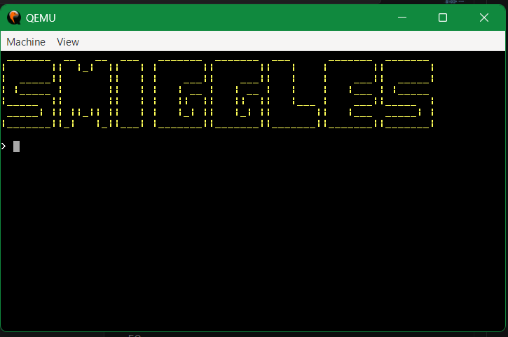
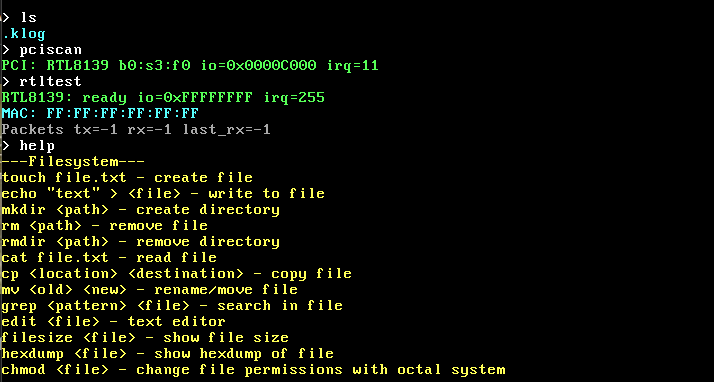

# Building Smiggles

First, make sure you've installed all the necessary tools listed in [gettingstarted.md](gettingstarted.md). Clone this repo (TheExpert24/smiggles) into your code editor. In the terminal, run these commands:
```
> cd myos
> make clean
> make
> make run
```

If all has gone well, you should see the QEMU emulator pop up running Smiggles.

You may get a couple messages in terminal warning that "image format was not specified" for floppy.img and hdd.img. This is nothing to worry about and you don't have to do anything.

## Some commands to try off the bat
You can try running:
```
> help
> ls
> pciscan
> rtltest
```

You should see something like this:
