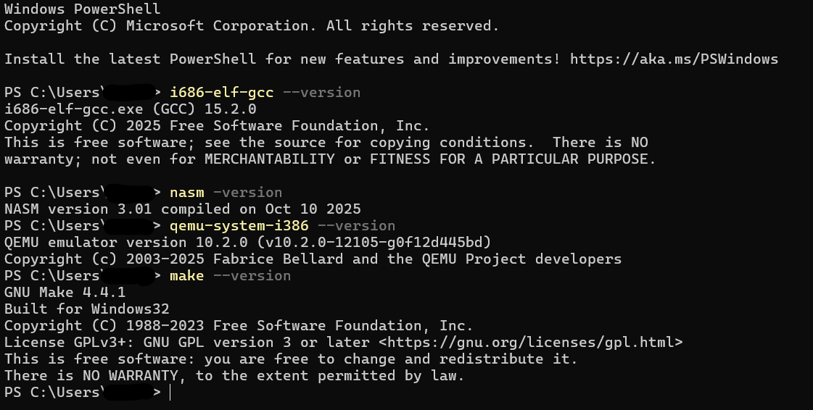

# Getting Started

## What Smiggles is
Smiggles is a small x86 OS that boots in QEMU. As of 4/7/26 it features a persistent in-kernel filesystem, basic process support, a working RTL8139 based network stack, and many other features major and minor.

## How to run Smiggles

You'll need 4 tools:
1) i686 ELF cross compiler
2) NASM (builds bootloader and assembly files)
3) QEMU (emulator used to run Smiggles)
4) GNU Make (runs build steps from the makefile)

### Windows steps
Install i686:
1) Download the prebuilt toolchain i686-elf-tools-windows.zip from [lordmilko/i686-elf-tools](https://github.com/lordmilko/i686-elf-tools/releases)
2) Extract it to some directory (e.g. C:\i686-elf-tools)
3) Add C:\i686-elf-tools\bin to your PATH enviroment variable
4) Test by opening a terminal and running ```i686-elf-gcc --version```

Install NASM:
1) Download NASM from [nasm.us](https://www.nasm.us) and install to the default location
2) Test by opening a terminal and running ```nasm -version```

Install QEMU
1) Install the latest Windows 64-bit installer from [QEMU](https://www.qemu.org/download/#windows), using default settings
2) Test by opening a terminal and running ```qemu-system-i386 --version```

Install GNU Make
1) Download the "Complete package" from [GNUWin32](https://gnuwin32.sourceforge.net/packages/make.htm)
2) Test by opening a terminal and running ```make --version```




### Mac steps

1) Install homebrew from [brew.sh](https://brew.sh/)
2) Run ```brew install i686-elf-gcc nasm qemu make```
3) Test each installation by running:
```i686-elf-gcc --version```
```nasm --version```
```qemu-system-i386 --version```
```make --version```


### Linux (Ubuntu/Debian) steps

1) Update package lists with ```sudo apt-get update```
2) Install the tools with ```sudo apt-get install build-essential nasm qemu-system-i386 make```
3) Test each installation by running:
```i686-elf-gcc --version```
```nasm --version```
```qemu-system-i386 --version```
```make --version```

**I have tested this installation sequence on Windows and Mac but I can't verify if it works on Linux. I think it should work but I'm not sure.**

Instructions for running smiggles are in [buildandrun.md](buildandrun.md).

